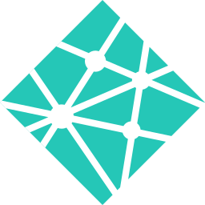

As the author of this project, I'll take you through my mind process when coming up with this project, designing it, developing it and deploying it.

## The Why

The original idea for ProBono was to create an accessible and free platform to connect people with development and design skills to people and organisations that are looking to benefit from the advantages of modern technology, but have no means of sourcing their own development team or to pay for expensive development.

Another issue I wanted to solve was the entry experience paradox, where companies in the industry will prefer to employ people who already have experience on at least one larger project, even at junior level.

Finally, open source only takes you so far. In some cases, even projects that are for non-profit purposes can be sensitive, making open-source not a suitable option for them.

## The What

ProBono is an emerging platform that connects people and organisations wanting to make the world a better place, with professionals, who are glad to contribute their time and expertise to help turn great ideas into reality.

ProBono respects that different places around the world have different regulations around facilitating charitable work. It is a tool to explore and communicate as well as to provide resources, but nothing more.

ProBono appreciates that the hardest part is getting started, which is why a simple and intuitive process guides you through every step from having an issue in the world to having it resolved via technology.

On the other end of the game, ProBono aims to make development of the projects as easy and straightforward as possible. After all it's charity work, but the quality shouldn't suffer. To make sure everyone's experience using ProBono is as good as possible - a suite of development tools will be available to aid developers in the process. A core team will also be at the disposal of project creators and developers alike.

## The How

There are two large milestones before ProBono can be launched.

In the first phase I will look into the best technologies that will help me deliver this project to the highest standards available. My main goal with ProBono is to connect developers with clients as well as technologies and platforms that can help them deliver amazing products, which is why I'll look for the support of like-minded companies with incredible tools and services in the development community. I will try to make use of as many of these technologies as possible to make this project a success and to of course I will document my journey to aid others in the community.

The second phase will be actually developing the main website and the services behind it. Upon gaining support of some companies I will start working closely with them to release ProBono to the public as soon as possible. At this time it will also become possible for developers who really resonate with this project and would like to help out - to join the core team and aid in the final steps of development.

## FAQ

**When can we expect the release of ProBono?**

While I would love to work on this full-time, it is non-profit, so I can't afford to do so. I will do my best to iterate on the project as fast as possible so that people can begin using it as early as a working prototype exists. That said, I would love to have the release some time in Q4 2019.

**What tech stack will you use?**

In this idea phase of the project I already began experimenting with different service providers and technological stacks to have a better picture of the effort needed to develop this project. Here's what's for sure:

The blog (this very website) uses:

- Client queries via [ GraphQL](https://graphql.org)
- Server side rendered [ React](https://reactjs.org/)
- Gluing it together and bundling content by [ Gatsby](https://www.gatsbyjs.org/)
- Hosted on [ Netlify](https://www.netlify.com/)

I looked into using the following on the main website:

- Language of choice is [ TypeScript](https://www.typescriptlang.org/)
- Client queries via [ GraphQL](https://graphql.org)
- Server-side rendered [ React](https://reactjs.org/)
- Server-side rendering with [ NextJS](https://www.nextjs.org/)
- Indexing and search with [ Algolia](https://www.algolia.com/)
- Data access layer with [ Prisma](https://www.prisma.io/)
- Server with GraphQL-Yoga and Express

In terms of integrations and other services I looked into these:

- [ GitHub](https://www.github.com/) for hosting code and managing the project
- [ Toggl](https://toggl.com/) for time tracking integration
- [ G Suite](https://gsuite.google.com/) for e-mail, documents, etc
- [ InVision](https://www.invisionapp.com/) for design sharing

Others will come up as the project progresses, so keep on the lookout for more.

**How can I get involved?**

If this project resonates with you and you feel you could help out or have any suggestions, do not hesitate to contact me on GitHub below.
